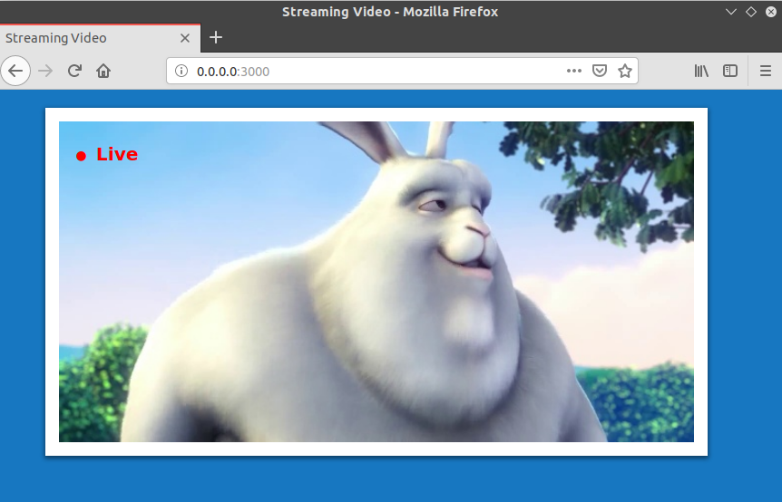

# Camera/Video HTTP Server in Golang 

## Install OpenCV for Go
```
$ go get -u -d gocv.io/x/gocv
$ cd $GOPATH/src/gocv.io/x/gocv
$ make install
```

## Run it
```
# serve the default webcam /dev/video0 
$ go run main.go 

# serve an ip camera stream / file / different device
$ go run main.go rstp://camera_ip:554/
```
<p align="center">
 
</p>
